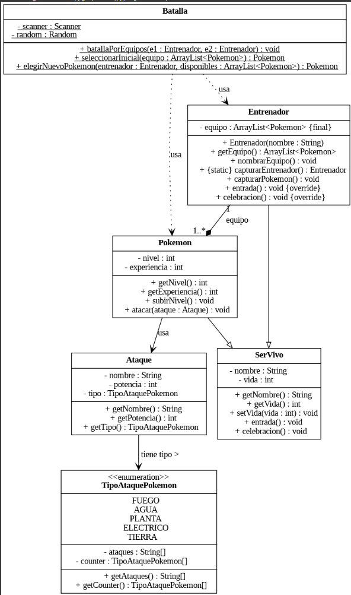

# Pokémon Battle Simulator

## 📌 Descripción
Este proyecto es un simulador de batallas Pokémon desarrollado en Java.

## 👥 Integrantes
- Samuel Agudelo Sosa - Código: 202459419
- Sebastián Saenz Mejia - Código: 202459528
- Samuel Romero Martinez - Código: 202459464(Temporalmente inmovilizado el brazo derecho)
- José Manuel Castaño Rojas - Código 202459522(Acordado)

## 🚀 Tecnologías utilizadas
- Java  
- Git y GitHub  
- Kanban (Trello o GitHub Projects)  

## 🏗️ Estructura del código
📂 `src/`
   - `ataque/` → Manejo de ataques
   - `batalla` → Lógica del juego  
   - `entrenador/` →Manejo del equipo
   - `main/` → Punto de entrada 
   - `pokemon/` → Manejo de los Pokémones 
   - `servivo/` → Padre de entrenador y pokemon
   - `tipoataquepokemon/` → Creación de ataques y tipo

### 📊 Diagrama UML del Juego



## 🔧 Instrucciones
1. Clonar el repositorio:  
   ```bash
   git clone https://github.com/tu_usuario/tu_repositorio.git
=======
## Getting Started

Welcome to the VS Code Java world. Here is a guideline to help you get started to write Java code in Visual Studio Code.

## Folder Structure

The workspace contains two folders by default, where:

- `src`: the folder to maintain sources
- `lib`: the folder to maintain dependencies

Meanwhile, the compiled output files will be generated in the `bin` folder by default.

> If you want to customize the folder structure, open `.vscode/settings.json` and update the related settings there.

## Dependency Management

The `JAVA PROJECTS` view allows you to manage your dependencies. More details can be found [here](https://github.com/microsoft/vscode-java-dependency#manage-dependencies)
